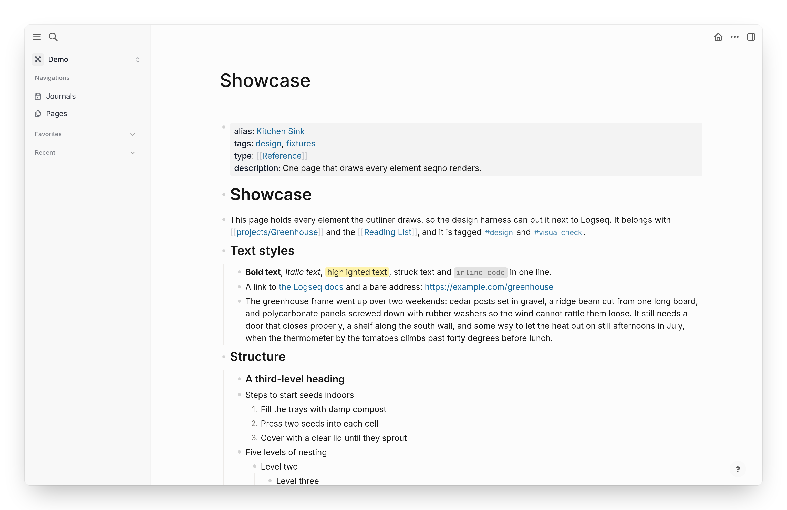
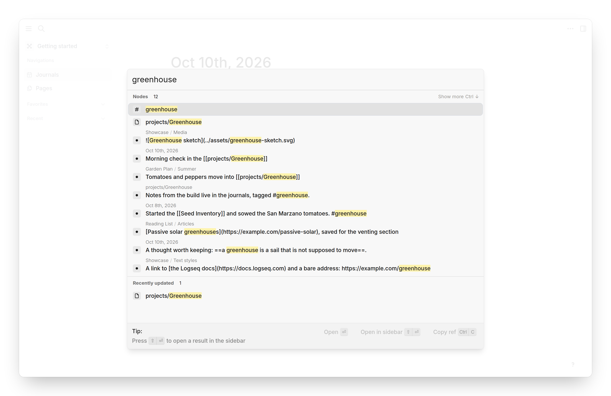
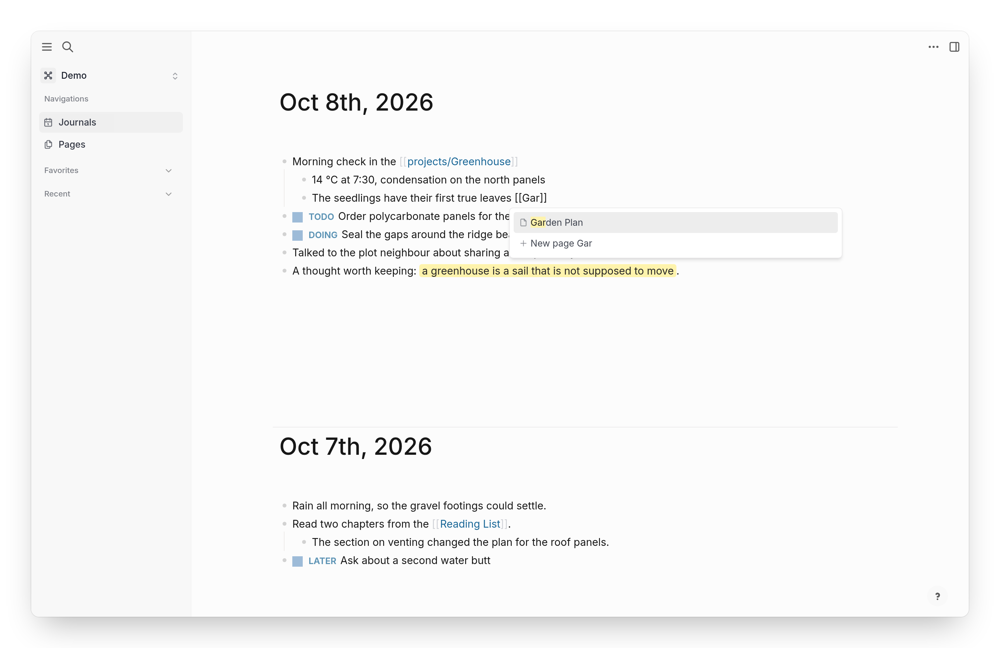
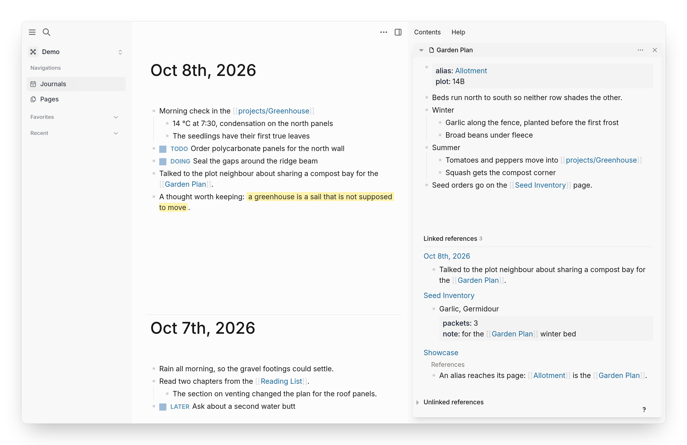

# seqno

A local-first outliner.

[](https://github.com/AVGVSTVS96/seqno/actions/workflows/ci.yml)

<picture>
  <source media="(prefers-color-scheme: dark)" srcset="docs/screenshots/showcase-dark.png">
  
</picture>

A couple of years ago I watched my favorite note-taking app get worse and worse, so I decided to rebuild it on a stack of really nice technologies. seqno looks and feels like Logseq and opens your Logseq graphs. The goal is to keep it as minimal as possible while making it as solid and clean as I can.

<table>
  <tr>
    <td width="33%">
      <picture>
        <source media="(prefers-color-scheme: dark)" srcset="docs/screenshots/search-dark.png">
        
      </picture>
    </td>
    <td width="33%">
      <picture>
        <source media="(prefers-color-scheme: dark)" srcset="docs/screenshots/editing-dark.png">
        
      </picture>
    </td>
    <td width="33%">
      <picture>
        <source media="(prefers-color-scheme: dark)" srcset="docs/screenshots/sidebar-dark.png">
        
      </picture>
    </td>
  </tr>
  <tr>
    <td align="center">Search</td>
    <td align="center">Linking pages</td>
    <td align="center">References</td>
  </tr>
</table>

## How it works

Every edit goes into a [Loro](https://loro.dev) CRDT log, so devices merge without conflicts. SQLite runs in a worker as a fast index you can always rebuild.

Built with [TypeScript](https://www.typescriptlang.org) 7, [Effect](https://effect.website) 4, [Loro](https://loro.dev), [SQLite](https://sqlite.org/wasm), [React](https://react.dev) 19, [CodeMirror](https://codemirror.net) 6 and [Vite](https://vite.dev) 8.

More in [architecture](docs/architecture.md), [decisions](docs/decisions.md) and [roadmap](docs/roadmap.md).

## Status

Early. The web app runs in Chrome and Edge; iOS and desktop come next. It's not ready for your real notes yet.

## Try it

Needs Node 24 and pnpm.

```sh
pnpm install
pnpm --filter @seqno/web dev
```

Open the URL it prints and click **Open the demo graph**.

## License

[MIT](LICENSE)
