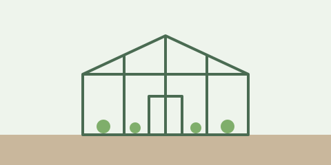

alias:: Kitchen Sink
tags:: design, fixtures
type:: [[Reference]]
description:: One page that draws every element seqno renders.

- # Showcase
- This page holds every element the outliner draws, so the design harness can put it next to Logseq. It belongs with [[projects/Greenhouse]] and the [[Reading List]], and it is tagged #design and #[[visual check]].
- ## Text styles
	- **Bold text**, *italic text*, ==highlighted text==, ~~struck text~~ and `inline code` in one line.
	- A link to [the Logseq docs](https://docs.logseq.com) and a bare address: https://example.com/greenhouse
	- The greenhouse frame went up over two weekends: cedar posts set in gravel, a ridge beam cut from one long board, and polycarbonate panels screwed down with rubber washers so the wind cannot rattle them loose. It still needs a door that closes properly, a shelf along the south wall, and some way to let the heat out on still afternoons in July, when the thermometer by the tomatoes climbs past forty degrees before lunch.
- ## Structure
	- ### A third-level heading
	- Steps to start seeds indoors
		- Fill the trays with damp compost
		  logseq.order-list-type:: number
		- Press two seeds into each cell
		  logseq.order-list-type:: number
		- Cover with a clear lid until they sprout
		  logseq.order-list-type:: number
	- Five levels of nesting
		- Level two
			- Level three
				- Level four
					- Level five, the deepest block on the page
	- A collapsed block with hidden children
	  collapsed:: true
		- This child stays hidden until the block is expanded
		- So does this one
- ## References
	- Water in the morning, never at night.
	  id:: 0192a5c4-7e10-7a3b-9c4d-5e6f70819203
	- The rule above, by reference: ((0192a5c4-7e10-7a3b-9c4d-5e6f70819203))
	- The same rule, embedded:
		- {{embed ((0192a5c4-7e10-7a3b-9c4d-5e6f70819203))}}
	- An alias reaches its page: [[Allotment]] is the [[Garden Plan]].
- ## Media
	- 
	- > Plant the tree you want to sit under in twenty years, and then go and water it.
- ## Properties
	- Tomato bed
	  variety:: San Marzano
	  location:: [[projects/Greenhouse]]
	  sown:: [[Oct 4th, 2026]]
	  plants:: 6
- ## Code
	- ```ts
	  const ripe = (fruit: { color: string }) => fruit.color === "red"
	  export const pick = (bed: ReadonlyArray<{ color: string }>) => bed.filter(ripe)
	  ```
	- ```python
	  def water(beds, litres=2):
	      for bed in beds:
	          bed.moisture += litres / bed.area
	  ```
	- ```css
	  .seedling {
	    color: #3a7d44;
	    transition: height 2s ease-in;
	  }
	  ```
- ## Tasks
	- TODO Order polycarbonate panels for the north wall
	- DOING Seal the gaps around the ridge beam
	- DONE Pour the gravel footings
	- LATER Paint the door frame
	- NOW Water the seedlings before noon
	- WAIT Hear back from the timber yard
	- WAITING Delivery of the shelf brackets
	- IN-PROGRESS Wire the fan to the thermostat
	- CANCELED Build a stand for the rain barrel
	- CANCELLED A second cold frame
	- TODO [#A] Fix the door latch before the storm
	- TODO [#B] Compare automatic vent openers
	- TODO [#C] Label the seed trays
	- TODO Check the frost cloth
	  SCHEDULED: <2026-10-08 Thu .+1w>
	- TODO Renew the allotment lease
	  DEADLINE: <2026-10-31 Sat ++1y>
	- DONE Prime the window frames
	  :LOGBOOK:
	  CLOCK: [2026-10-04 Sun 09:12:30]--[2026-10-04 Sun 10:47:05] =>  01:34:35
	  :END:
